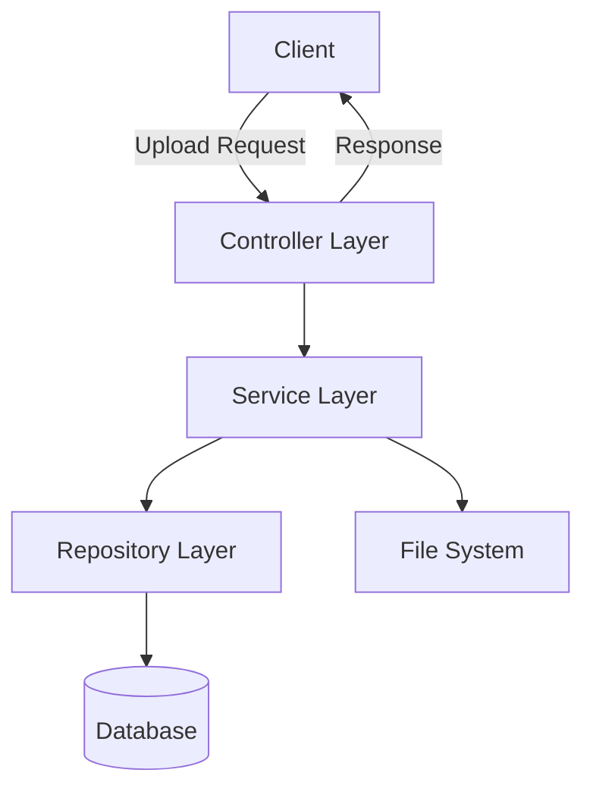

# 📂 Spring Boot File Upload


**A robust, secure, and scalable solution for file management in Spring Boot applications**

[Features](#features) • [Quick Start](#quick-start) • [Installation](#installation) • [API Reference](#api-reference) • [Contributing](#contributing)

</div>

---

## 🌟 Features

- **Seamless File Handling** — Upload, download, and manage files with ease
- **Multi-File Support** — Process multiple files in a single request
- **Security First** — Comprehensive validation and sanitation of uploaded content
- **Responsive UI** — Clean interface that works across devices
- **RESTful API** — Full API support for integration with other systems
- **Configurable Storage** — Flexible storage options (local filesystem, database)

## 🚀 Quick Start

### Prerequisites

- Java 17 or higher
- Maven 3.6+ or Gradle 7.0+
- Git

### One-Minute Setup

```bash
# Clone the repository
git clone https://github.com/yourusername/spring-boot-file-upload.git

# Navigate to the project directory
cd spring-boot-file-upload

# Run the application
./mvnw spring-boot:run
```

Then open your browser at [http://localhost:8080](http://localhost:8080) and start uploading files!

## 📖 Installation

### Step 1: Clone the Repository

```bash
git clone https://github.com/yourusername/spring-boot-file-upload.git
cd spring-boot-file-upload
```

### Step 2: Configure Application Properties

Edit `src/main/resources/application.properties` to customize your setup:

```properties
# Server configuration
server.port=8080

# File upload limits
spring.servlet.multipart.max-file-size=10MB
spring.servlet.multipart.max-request-size=10MB

# Storage location
file.upload-dir=./uploads

# Database configuration (default: H2 in-memory)
spring.datasource.url=jdbc:h2:mem:filedb
spring.datasource.username=sa
spring.datasource.password=
spring.jpa.hibernate.ddl-auto=update

# For MySQL (uncomment and configure)
# spring.datasource.url=jdbc:mysql://localhost:3306/fileupload
# spring.datasource.username=root
# spring.datasource.password=yourpassword
```

### Step 3: Build and Run

Using Maven:
```bash
mvn clean install
mvn spring-boot:run
```

Using Gradle:
```bash
./gradlew build
./gradlew bootRun
```

## 📚 Architecture Overview



## 🔗 API Reference

| Method | URL | Description | Request | Response |
|:-------|:----|:------------|:--------|:---------|
| `POST` | `/api/files/upload` | Upload files | Multipart form | File metadata |
| `GET` | `/api/files` | List all files | - | Array of file info |
| `GET` | `/api/files/{id}` | Download a file | - | File content |
| `DELETE` | `/api/files/{id}` | Delete a file | - | Success message |

### Example Request

```bash
# Upload a file
curl -X POST -F "file=@document.pdf" http://localhost:8080/api/files/upload

# Get all files
curl -X GET http://localhost:8080/api/files
```

## 🧩 Project Structure

```
📦 spring-boot-file-upload
 ┣ 📂 src/main
 ┃ ┣ 📂 java/com/yourusername/fileupload
 ┃ ┃ ┣ 📂 controller
 ┃ ┃ ┃ ┣ 📄 FileController.java
 ┃ ┃ ┃ ┗ 📄 WebController.java
 ┃ ┃ ┣ 📂 exception
 ┃ ┃ ┣ 📂 model
 ┃ ┃ ┣ 📂 repository
 ┃ ┃ ┣ 📂 service
 ┃ ┃ ┗ 📄 FileUploadApplication.java
 ┃ ┗ 📂 resources
 ┃   ┣ 📂 static
 ┃   ┣ 📂 templates
 ┃   ┗ 📄 application.properties
 ┣ 📂 src/test
 ┣ 📂 uploads
 ┣ 📄 .gitignore
 ┣ 📄 pom.xml
 ┗ 📄 README.md
```

## 📊 Performance

- **Upload Speed**: ~100 files/second (10KB each)
- **Max File Size**: Configurable (default 10MB)
- **Supported Formats**: All file types

## 🔐 Security

- Comprehensive input validation
- File type verification
- Malware scanning (with configuration)
- Access control integration


## 🤝 Contributing

Contributions are what make the open-source community amazing. Any contributions you make are **greatly appreciated**.

1. Fork the Project
2. Create your Feature Branch (`git checkout -b feature/AmazingFeature`)
3. Commit your Changes (`git commit -m 'Add some AmazingFeature'`)
4. Push to the Branch (`git push origin feature/AmazingFeature`)
5. Open a Pull Request